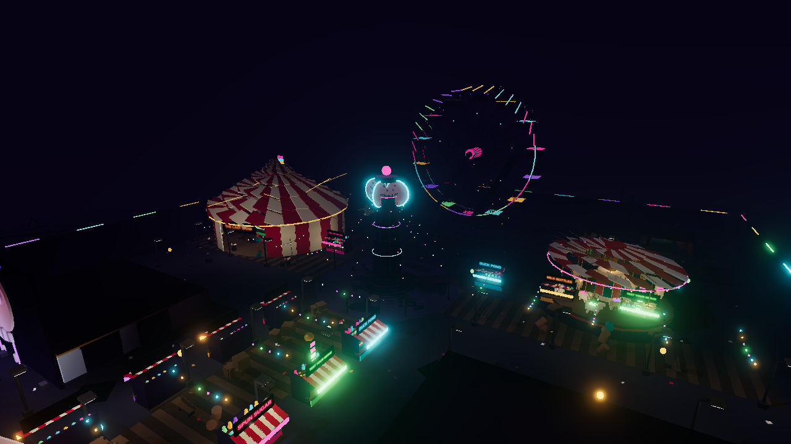
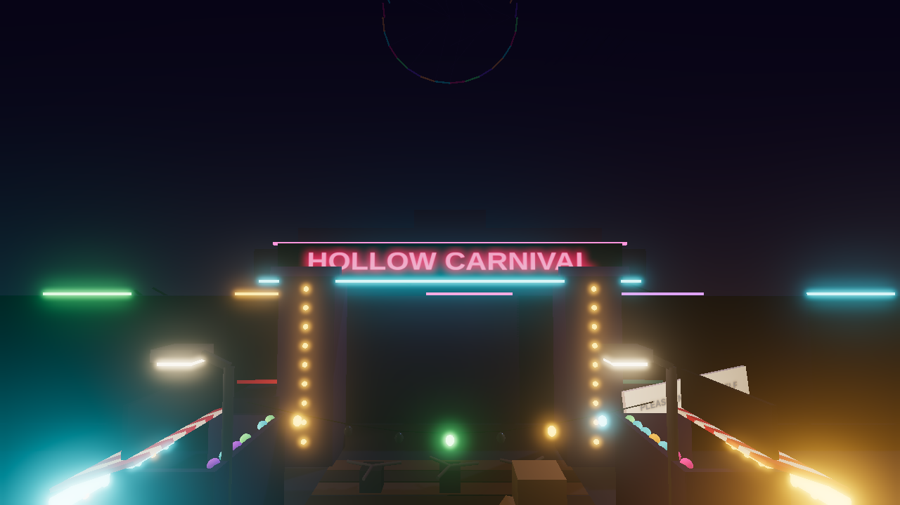
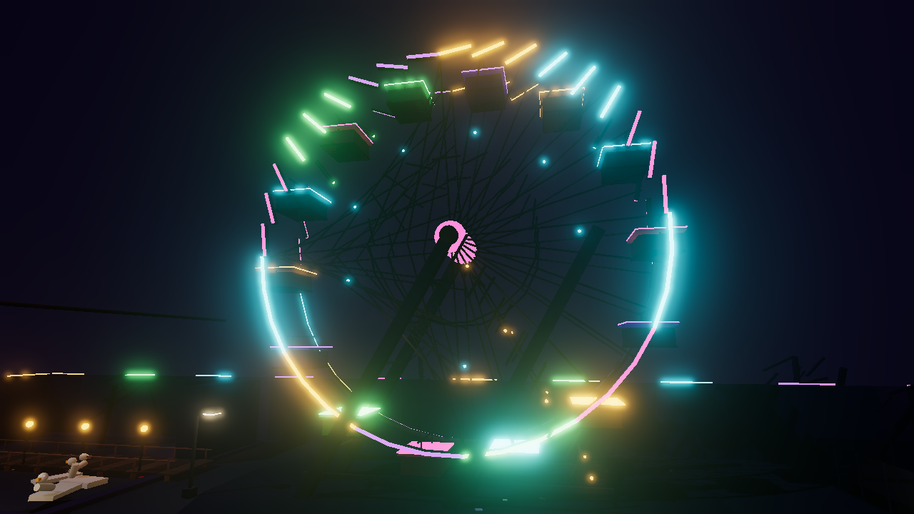
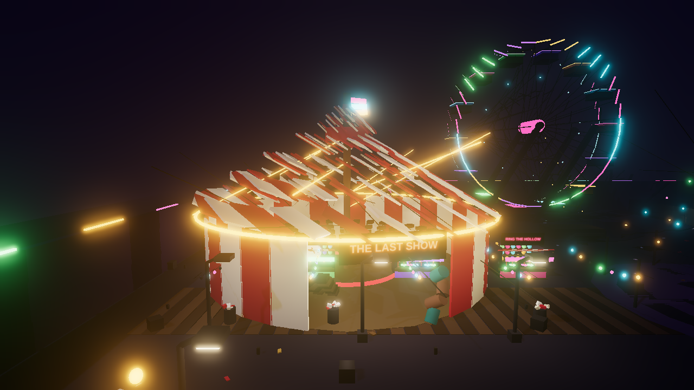
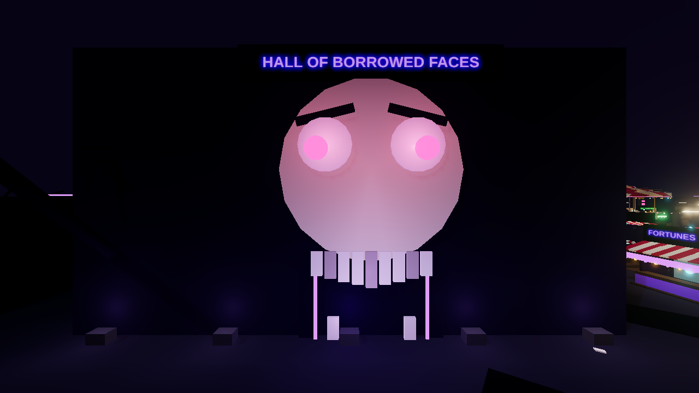
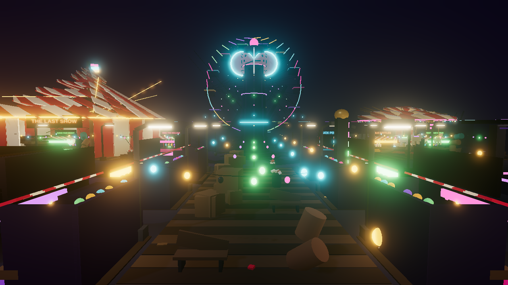
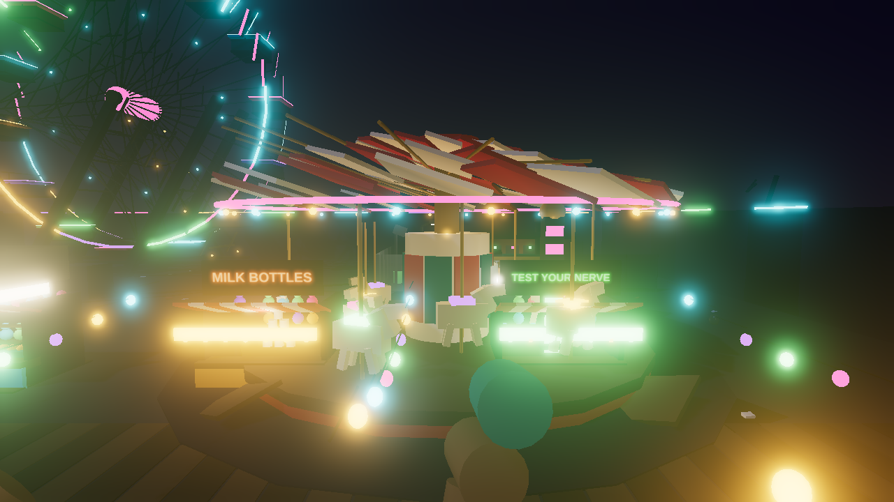

# Hollow Carnival

**A murder mystery game for Roblox.** *The rides never stopped. Neither did the killer.*

An abandoned seaside carnival still has power. The wheel still turns, the calliope still plays,
and somewhere between the stalls one of you is holding a knife. Twelve people walk in, the
generator coughs, and the lights go out on a timer.



---

## What is in this repository

Two things that read from the same source of truth:

1. **The game** — a complete Roblox place: Luau server and client, a procedurally generated map,
   round loop, roles, weapons, coins, blackouts, HUD and post-processing. Built with
   [Rojo](https://rojo.space), so it is plain files in git rather than a binary `.rbxl`.
2. **A browser previsualizer** — a three.js renderer plus a headless bot simulation that plays
   full rounds using the shipped rules, the shipped map and the shipped navigation graph.

The previsualizer exists because **Roblox Studio does not run on Linux**, which is where this was
built. Rather than develop blind, the map is generated as data (`build/MapData.json`) and two
renderers consume it: `src/server/MapBuilder.luau` turns it into Roblox `Part` instances, and
`web/src/renderer/mapMesh.js` turns it into three.js meshes. Same geometry, same lights, same
colours, same `GameConfig.json`. What you see in the browser is what the place file contains.

It also turned out to be the best testing tool in the project: it plays hundreds of rounds a
second with no client attached, which is how the balance numbers below were set.

---

## The park

Nine landmarks, 4,673 parts and 353 lights, all generated from a seeded PRNG so the output is
byte-identical on every machine.

<table>
<tr>
<td width="50%"><br><b>The gate</b> — where the round starts, and the only sign that still works</td>
<td width="50%"><br><b>The Wheel of Hollow Hours</b> — turns all round, lit from the rim</td>
</tr>
<tr>
<td><br><b>The Big Top</b> — one way in, plenty of dark inside</td>
<td><br><b>Hall of Borrowed Faces</b> — a mirror maze wired into the navigation graph</td>
</tr>
<tr>
<td><br><b>The midway</b> — stall row, and the only well-lit ground in the park</td>
<td><br><b>Carousel of Borrowed Faces</b> — still spinning, no riders</td>
</tr>
</table>

The rest: the Hollow Hour Clock (stopped at 3:33), Dodge Me, the generator yard that drives the
blackouts, and the Tunnel of Love out on the pier.

### Watch a round

`docs/media/` has stills. To generate the video yourself:

```bash
npm run dev                 # terminal 1: serves the previsualizer
npm run demo                # terminal 2: renders artifacts/hollow-carnival-demo.mp4
```

---

## How it plays

A round is a loop, and the loop never stops while anyone is connected:

```
Intermission (20s)  ->  Grace (6s)  ->  Round (up to 180s)  ->  Post-round (9s)  ->  repeat
      lobby            roles dealt        knives out            payouts
```

**Roles** are dealt at the start of Grace. There is always one murderer, a second from 11 players
and a third from 20; a sheriff appears at 3 players and a second at 14. Everyone else is innocent.
Anyone who drew a special role in the last two rounds sinks down the pool, so the knife moves
around the lobby instead of landing on the same unlucky player three rounds running.

| Role | Has | Wants |
|---|---|---|
| **Innocent** | nothing but a coin purse | survive, and work out who is holding the knife |
| **Sheriff** | the only revolver | kill the murderer — but shooting an innocent kills *you* |
| **Murderer** | a knife they can throw, and Shroud | everyone else |
| **Hero** | a revolver picked up off a dead sheriff | finish what the sheriff started |

**The revolver is the comeback mechanic.** When a sheriff dies it drops where they fell and
anybody can take it. That is how an innocent becomes a Hero, and it is why killing the sheriff
first is not automatically a win for the murderer.

**Coins** spawn across the park and are the only reason to leave cover. Forty-two at a time out of
104 possible spots, respawning on a timer. They pay out at the end of the round.

**Blackouts** are the theme doing mechanical work. The generator yard cuts the park lights 42
seconds into a round and every 52 seconds after that, for nine seconds each time, with a
three-and-a-half second warning as the generator coughs. In the dark the fog closes to 115 studs,
the murderer gets a small speed bonus, and a handful of emergency lights are the only thing you
can navigate by. Everyone's plan changes.

**Movement** is stamina-limited: sprinting drains, standing still recovers after a beat, and the
murderer is always slightly faster than you.

Every number in the two paragraphs above lives in
[`config/GameConfig.json`](config/GameConfig.json) — the server, the client HUD, the bot
simulation and the tests all read it. Nothing is hardcoded twice.

---

## Running it

### Prerequisites

- [Rokit](https://github.com/rojo-rbx/rokit) for the Roblox toolchain, then `rokit install`
  (pins Rojo 7.7.0 and Lune 0.10.5 from [`rokit.toml`](rokit.toml))
- Node.js 20+
- Roblox Studio, if you want to actually play it

### Build the place

```bash
npm install
npm run place     # generates the map, then builds build/HollowCarnival.rbxlx
```

Open `build/HollowCarnival.rbxlx` in Studio and press Play. For a real test use **Test > Players >
2 players or more** — with one player the round loop parks in Intermission, because a murder
mystery needs somebody to murder.

To iterate with Studio live-syncing your edits:

```bash
npm run serve     # rojo serve, then connect from the Rojo plugin in Studio
```

### Run the previsualizer

```bash
npm run dev       # http://localhost:5173
```

It loads the map, bakes the lighting, drops in twelve bots and plays rounds forever.

| Key | |
|---|---|
| `Space` | pause |
| `C` | cut to the next shot |
| `F` | free-fly — `WASD`, `Q`/`E` for height, `Shift` to move fast, drag to look |
| `1`–`4` | speed: 1×, 2×, 4×, 8× |
| `R` | restart the round |

---

## Testing

```bash
npm test          # everything: 82 Luau tests, 14 JavaScript tests
npm run test:luau # Lune: rules, map validation, source compilation
npm run test:js   # Node: Luau/JS parity, headless round simulation
```

There is no Roblox runtime on Linux, so the Luau tests run under
[Lune](https://lune-org.github.io/docs) against a small shim
([`tests/lib/roblox.luau`](tests/lib/roblox.luau)) that provides `game:GetService`, `script.Parent`
and Roblox-style `require`. Anything that needs a real `Instance` is deliberately not unit tested;
instead the rules were pulled out into [`src/shared/RoundLogic.luau`](src/shared/RoundLogic.luau),
which is pure and therefore testable.

What the suites actually check:

- **`tests/rules.test.luau`** — role counts at every lobby size, the recent-role cooldown, win
  conditions, phase durations, blackout timetables, payouts.
- **`tests/map.test.luau`** — validates the generated map: no degenerate or out-of-bounds parts,
  the shadow budget is small enough to ship, some lights survive a blackout, every animator drives
  a group that exists, spawns are further apart than knife range, and **the whole park is
  reachable from the entrance** (a connectivity check that has caught a walled-off bumper car
  arena and a pier that did not join the shore).
- **`tests/sources.test.luau`** — every server and client file compiles and is `--!strict`.
- **`tests/rules-parity.test.mjs`** — the rules exist twice, in Luau for the game and JavaScript
  for the previsualizer. This dumps both to JSON and diffs them, so the simulation cannot quietly
  drift away from the thing it is meant to be simulating.
- **`tests/sim-smoke.test.mjs`** — plays dozens of full rounds headlessly and asserts they reach a
  decision, that both sides win sometimes, that bots stay on the navigation graph and inside the
  walls, that blackouts fire and recover, that coins get collected, and that a dropped revolver
  can still create a Hero.

### Balance

`tools/sim-report.mjs` is the dial. It plays the real rules on the real map:

```
$ node tools/sim-report.mjs --samples=40
40 rounds, 12 bots each
round length  p10 20s   median 67s   p90 180s
  MurderersWin    17  43%
  InnocentsWin    17  43%
  TimeUp           6  15%
```

An earlier build had the innocents winning every single round: the bots recognised the murderer
from 40 studs away, so the sheriff simply walked up and shot them. Dropping recognition to 18
studs, shortening how long a witnessed murderer stays marked, and teaching the murderer to break
off and flee when someone armed is looking at them produced the spread above.

`--timeline` replays the exact round the previsualizer shows and prints when each beat lands,
which is how the demo capture knows where to start.

---

## Layout

```
config/GameConfig.json     every tunable number, read by all four consumers
default.project.json       Rojo: files -> Roblox instances

src/shared/                RoundLogic (pure rules), Net (remotes), Types
src/server/                GameService (the loop), MapBuilder, Weapon/Coin/Blackout/Character
src/client/                Hud, RoleReveal, Atmosphere, Input

tools/map/                 the map generator, one module per district
tools/generate-map.mjs     runs it: geometry, nav graph, spawns, coin spots -> MapData.json
tools/capture-*.mjs        headless Chrome stills and frame-by-frame video
tools/sim-report.mjs       balance sampling and round timelines

web/src/renderer/          three.js: meshes, materials, baked lighting, signs
web/src/sim/               the same rules in JS, plus A* navigation and bot AI
web/src/ui/                HUD and the camera director

tests/                     Lune suites, the Roblox shim, and the Node parity/simulation tests
```

### A note on lighting

353 lights is far more than either renderer wants to shade in real time, so both cheat, in
different ways.

The previsualizer bakes irradiance from every light into vertex colours at load, then keeps a pool
of twelve real point lights that follow the camera for specular highlights. The Roblox build culls
by brightness and range and allows only a small number of shadow casters — the rest of the glow is
`Neon` material carrying the look, which is free.

That difference is the main reason the browser is a *previsualizer* and not a preview: the
geometry and colours are exact, the lighting is a good-faith approximation. The previsualizer also
draws a coloured halo over every character so you can read the round at a glance, which is a
spectator affordance the game itself does not give you.

## Known gaps

- **No audio.** `GameConfig.json` names the moods each phase wants (`calliope_detuned`,
  `generator_hum`) but no sounds are wired up; they need Roblox asset IDs, which need an upload.
- **Nothing has been played by humans.** Every claim about balance here comes from bots. The
  numbers are a starting point for a real playtest, not the end of one.
- **Coins have no shop.** They accumulate and pay out, and then there is nothing to spend them on.
